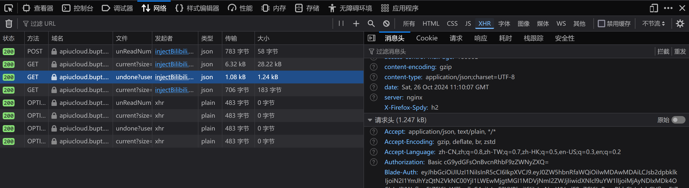

# bupt_spider

本项目是基于北京邮电大学网站的爬虫项目，以下是程序的使用说明。

## 待办事项（undone_list.py）

1. 将自己的真实账号和密码填入username和passsword
2. blade-auth 的获取方法如下：
   1. 使用浏览器打开网址："https://ucloud.bupt.edu.cn/uclass/#/student/homePage?roleId=1318863781576577025"
   2. 按下F12打开开发者工具，选择"网络"，然后刷新页面
   3. 选择"xhr"，然后找到 "blade-auth"，复制它的值填入即可，如图所示：